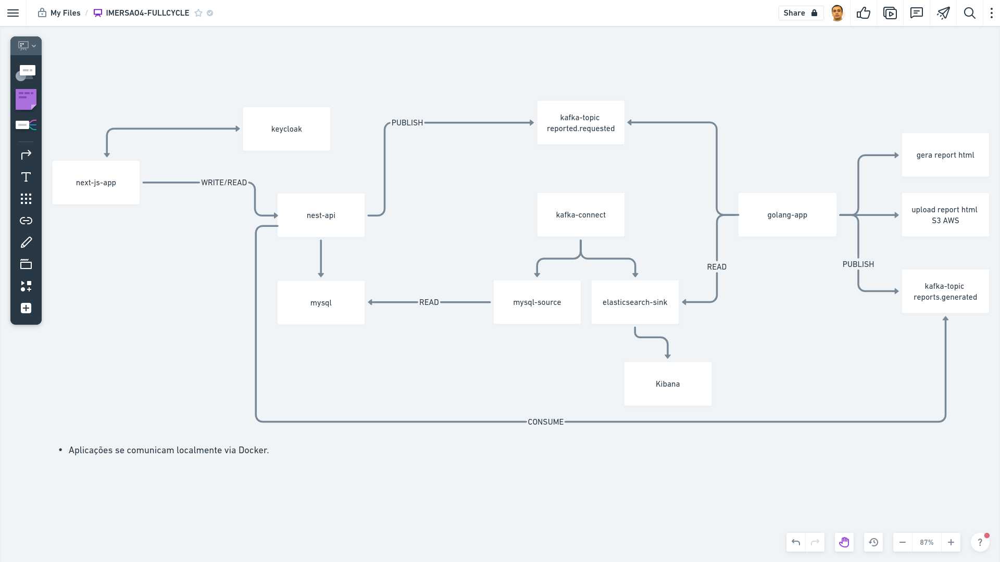

# Imersão #4 FullCycle: Fin Cycle

Abaixo, consta um desenho atualizado, apresentando, de forma simplificada, como funciona o fluxo desse desafio. A princípio, aparenta ser um sistema simples de controle das transações financeiras realizadas, denominado _Fin Cycle_.

Ao acrescentar alguns requisitos, porém, o sistema ganha maior complexidade. Por exemplo:

1. Deve haver um cadastro de relatórios a serem solicitados ao sistema por período - aí, já se percebe o uso de comunicação assíncrona para o processamento em _background_ (via _Apache Kafka_);
2. O _Keycloak_ atua como servidor de identidade ao prover autenticação para as aplicações de _frontend_ e _backend_ (_Nest.js_);
3. A aplicação de _backend_ notifica via _Kafka_ a aplicação _Go_ para gerar um novo relatório e armazená-lo na nuvem (_AWS S3_) e retornar uma mensagem via _Kafka_ para o _backend_;
4. Ao finalizar o processamento do relatório, o sistema deve disponibilizá-lo através de um _link_ na tela de listagem dos relatórios (_Next.js_).
5. O _Kafka Connect_ atua como ferramenta para integrar os dados da aplicação de _backend_ com o _ElasticSearch_;
6. O _ElasticSearch_ atua conjuntamente com o _Kibana_ como ferramenta de observabilidade e com a aplicação _Go_ como fonte de dados.

#### Que problemas de negócio o projeto poderia resolver?
- O projeto pode ser adaptado para casos de uso onde é necessário processar relatórios de pagamentos e transações financeiras em tempo real, como em bolsas de valores, bancos e seguradoras.

## Tecnologias

- #### Autenticação
  - OAuth 2
  - OpenID Connect
  - Keycloak
  
- #### Backend
  - TypeScript
  - Nest.js
  - Apache Kafka
  - Golang
  - AWS S3
  - Kafka Connect
  - MySQL
  
- #### SPA (Single Page Application)
  - TypeScript
  - Next.js
  - React.js
  
- #### Observabilidade
  - ElasticSearch
  - Kibana
  

### Keycloak

Outro requisito agregando complexidade ao sistema é de que deve ser _multitenancy_, o que quer dizer que o sistema deve proteger/isolar por domínios o uso dele por cada cliente. Contemplar esse requisito abrange, também, prover autenticação e autorização, o que pode ser atendido com o uso de uma ferramenta de gerenciamento de acessos e identidade, como o _Keycloak_.

Por que _Keycloak_, especificamente? Entre as razões, podemos citar que é uma ferramenta _Open Source_, mantida pela _RedHat_ e que vem sendo amplamente adotada no mercado nos últimos anos. O _Keycloak_ é escrito em _Java_ e roda sob um servidor de aplicações _JBoss_, assim, pode ser integrado na orquestra de microsserviços também como um microsserviço que provê autenticação e autorização para todas as demais aplicações.

Outra facilidade é que o _Keycloak_ se integra bem com tecnologias de _frontend_, como o _React_, sendo que a aplicação _frontend_ é desenvolvida com _NextJS_, um framework _React_.

Seguindo o fluxo desenhado do sistema, iniciamos pela tela de _login_ na aplicação _NextJS_. Essa, na verdade, é uma página que o _Keycloak_ provê, seguindo um processo conforme protocolo de autorização _OAuth2_. O _Keycloak_, então, autentica conforme o protocolo de autenticação _OpenID Connect_, que é uma camada acima do protocolo _OAuth2_ para prover autenticação. Autenticando com sucesso, o usuário é movido, automaticamente, para dentro da aplicação, onde pode visualizar a listagem das suas transações financeiras.

A partir da autenticação, é gerado um token _JWT_ que é armazenado, pela aplicação _frontend_, em um _cookie_ no _browser_. Cada _request_ que a aplicação _frontend_ faz para a aplicação _backend_ (_nest-api_) utiliza esse _token_ para autorização. Então, de forma à aplicação _backend_ não precisar bater no Keycloak a cada request para autorizar, garantindo melhor desempenho da rede, a aplicação _backend_ recebe uma chave pública emitida pelo _Keycloak_ para validar se o _token_ é válido.

### Backend

Com relação à aplicação _backend_. É uma aplicação desenvolvida com _NestJS_. _NestJS_ é um poderoso _framework_ _Node.js_, que vem sendo amplamente adotado nos últimos anos no mercado, apesar de ser relativamente novo (nasceu em 2017), principalmente, para construção de aplicações de microsserviços. É interessante que o _NestJS_ comporta uma _API_ específica com suporte a funcionalidades de microsserviços, como comunicação com message _brokers_, como o _RabbitMQ_, _Kafka_, etc. Ele é baseado todo no conceito de módulos e estrutura de arquitetura _MVC_ (_Model-View-Controller_), empregando algumas das idéias de arquitetura do _Angular_.

### Frontend

Com relação à aplicação _frontend_. É uma aplicação desenvolvida com _NextJS_. O _NextJS_ contempla um conjunto de funcionalidades já prontas de um _framework_ para incorporar à biblioteca _React_. Podemos citar, entre algumas delas, um melhor tratamento para:

- O roteamento de páginas; 

  - Sendo feito através da própria estrutura de pastas/arquivos da aplicação, ao invés de fazer via código.

- O desempenho na renderização de páginas:

  - Aí, o _NextJS_ provê algumas estratégias, como: _Server-Side-Rendering_ (_SSR_), _Client-Side-Rendering_ (_CSR_), _Static-Site-Generation_ (_SSG_): 
  
    - Na aplicação _frontend_, é empregado a estratégia _SSR_, que consiste em renderizar a página no servidor e entregar a página já pronta para o _browser_;
    - Essa estratégia deve ser empregada com cautela, por ser menos performática, mas deve ser usada no caso em que os dados são muito dinâmicos, onde é necessário uma atualização mais constante da página;
    - É o caso da página de listagem dos relatórios, em que o usuário deseja ver o _link_ do relatório processado assim que estiver disponível.

### Kafka

O sistema utiliza o _Apache Kafka_ como ferramenta de mensageria para comunicação entre as aplicações. Uma das razões pela escolha do _Kafka_ é que ele agrega outras funcionalidades, além do papel de _message broker_. A própria definição do _Apache Kafka_ dispõe que trata-se uma plataforma de _stream_. Assim, outra ferramenta que compõe o ecossistema _Kafka_ é o _Kafka Connect_, que pode ser usado para transportar os dados de um sistema para outro em tempo real. Para tanto, ele utiliza um conector (_source_) que puxa os dados de uma fonte de dados em um sistema origem e entrega para um tópico do _Kafka_. Então, outro conector (_sink_) lê os dados desse tópico no _Kafka_ e despeja em outra fonte de dados qualquer.

No momento em que o usuário cria um novo filtro de relatório de transações no sistema, ele está solicitando, na verdade, que o sistema processe um novo relatório com as transações financeiras do período desejado.

Então, a aplicação _frontend_ comunica de forma síncrona com a aplicação _backend_ via _REST_. A aplicação _backend_ recebe a solicitação para persistir os dados do filtro de relatório no banco _MySQL_. E, após criar um novo registro na base de dados, a aplicação de _backend_ atua como um produtor de mensagem para o _Apache Kafka_, publicando uma nova mensagem no tópico _reported.requested_.

### Elasticsearch

Também acontece a atuação do _Kafka Connect_ nesse momento: quando é criado um novo registro no banco de dados _MySQL_, o conector _MySQL_ do _Kafka Connect_ puxa o dado para um tópico no _Kafka_. Então, outro conector do _Elasticsearch_ consome o dado desse tópico e despeja no banco de dados do _Elasticsearch_.

É interessante que o banco de dados do _Elasticsearch_ também pode ser usado por outras aplicações, além do _Kibana_ para prover _logs_, métricas e _tracing_ (observabilidade) na forma de _dashboards_ e gráficos. No caso do sistema de controle financeiro, o _Elasticsearch_ é usado pela aplicação _Golang_ para obter os dados para compor o relatório de transações financeiras realizadas.

### Golang

A aplicação encarregada pela geração dos relatórios é desenvolvida em _Go_. E adota conceitos de _design_ de Arquitetura Hexagonal (_Ports and Adapters_), _Clean Architecture_ e _Domain-Driven Design_ (_DDD_):

> Arquitetura Hexagonal / _Clean Architecture_ / _DDD_

  - #### Permite trabalhar com um _design_ focado em solucionar o problema do domínio;

    - Vamos ter uma camada de domínio responsável por resolver a complexidade do negócio;
  
  - #### Permite deixar a complexidade técnica para ser resolvida por uma camada de infraestrutura;

    - Vamos ter uma camada de infraestrutura responsável por resolver o sistema de _stream_ (_Kafka_) e banco de dados (_ElasticSearch_);

- Com isso:

    - A  aplicação torna-se flexível para adicionar/remover componentes de infraestrutura sem precisar alterar _nenhum_ outro componente da aplicação ou o modelo de domínio;

A aplicação Golang é responsável por:

1. Consumir a mensagem do tópico _reported.requested_;
2. Gerar um arquivo no formato _HTML_;
3. Fazer o _upload_ desse arquivo para um _bucket_ _S3_ na _AWS_;
4. Produzir uma nova mensagem para o tópico _reports.generated_ com a _URL_ assinada (ou seja, válida por 24 horas) para o arquivo _HTML_ armazenado na nuvem.

A aplicação de _backend_, então, consome a mensagem do tópico _reports.generated_ e atualiza o banco de dados _MySQL_ com o status de relatório Completo, ao invés de Pendente, mais a _URL_ gerada.

A partir desse momento, o usuário pode atualizar a página de listagem de relatórios e ver que está disponível o _link_ para o relatório de transações realizadas.

> Docker

- Uma observação importante é que todas as aplicações envolvidas rodam localmente em _conteiners_ _Docker_, o que facilita todo o processo de desenvolvimento, porque tira do desenvolvedor qualquer responsabilidade ou preocupação com a instalação de ferramentas.
